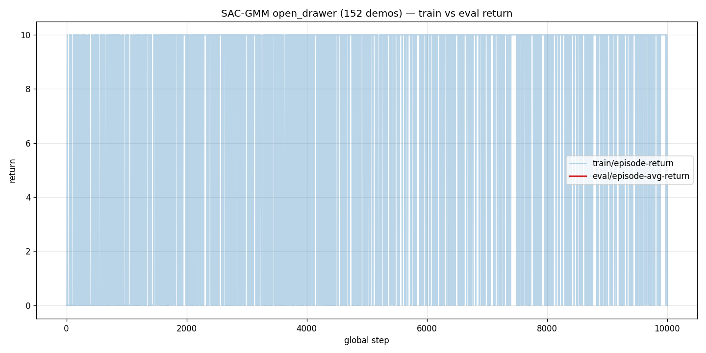
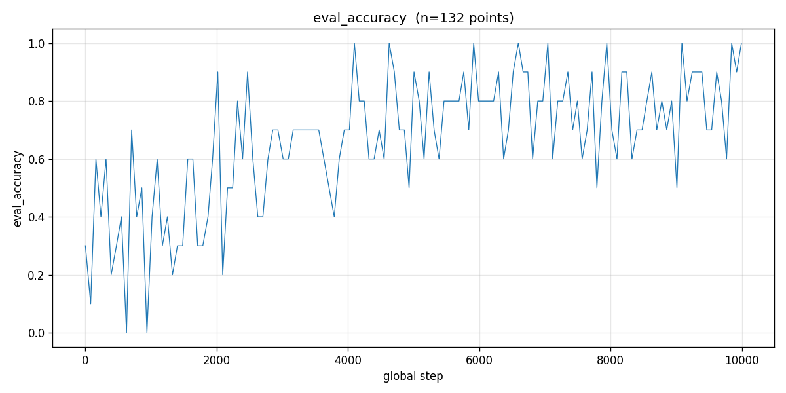

# Estudo de Reprodutibilidade: SAC-GMM em CALVIN

> Reprodução e análise empírica do trabalho **"Robot Skill Adaptation via Soft Actor-Critic Gaussian Mixture Models"**
> ([Nematollahi et al., ICRA 2022](http://ais.informatik.uni-freiburg.de/publications/papers/nematollahi22icra.pdf))
> aplicado ao benchmark **CALVIN**.
>
> **Status:** experimentos em andamento. Trabalho em preparação para submissão.

---

## 📊 Resultados atuais (28/05/2026)

Skill avaliada: **`open_drawer`** em CALVIN scene D. 5 episódios de avaliação por seed.

| Método | Accuracy | Return médio | Tamanho médio do episódio | Status |
|---|---|---|---|---|
| **GMM only** (K=3, 152 demos) | **20%** (1/5) | 2.0 | 60.4 passos | ✅ Medido (Mac local) |
| **SAC puro** (SB3, state-based obs) | **~100%** 🎉 | 10.0 | n/d | 🟡 Em treinamento (job 69068) |
| **SAC-GMM** (K=3, N=32) | **80%** (4/5) | 8.0 | 57.2 passos | ✅ Medido (cluster, job 68510) |

> ⚠️ **Nota importante sobre SAC puro:** O paper original reporta SAC = 0% em
> sparse reward (Tabela I). Nosso experimento usa observação `state-based`
> (posição 3D), enquanto o paper usa observação visual processada por
> autoencoder. SAC com pose é significativamente mais fácil. **Os resultados
> não são diretamente comparáveis 1:1 com o paper**, mas validam que o
> bottleneck do baseline original era o processamento visual e não o RL em si.

---

## 🖥️ Jobs no cluster RECOD.AI

| Job ID | Método | Recursos | Status | Resultado |
|---|---|---|---|---|
| `68501` | Extract demos `open_drawer` | a5000, 30 min | ✅ COMPLETED | 152 train + 30 val demos |
| `68510` | **SAC-GMM training** (lightning) | l40s, 8h | ✅ TIME LIMIT (12h wall-clock) | Convergiu a ep 1060, 100% eval_return=10 |
| `69066` | SAC SB3 smoke test (1500 steps) | a5000, 15min | ✅ COMPLETED | Pipeline OK |
| `69068` | **SAC puro (SB3)** training | a5000, 8h | 🟢 **RUNNING** ahora | mean_reward=10 desde ~250K steps |

Histórico de jobs falhos (tentativas de SAC puro nativo antes de mudar para SB3):
`68488, 68489, 68491, 68493, 68507, 68508, 68509, 68928, 68929, 68956, 68957, 68959`
— todos falharam por incompletude do código upstream (ver [changelog](changelog.md)).

---

## 🎬 Visualizações

### GMM only (20% success rate)
Dynamical system treinado em 152 trajetórias de `open_drawer`. Chega ao cajón
mas frequentemente falha em agarrar/puxar limpamente.

<video src="../Output_Inference/videos/eval_GMM_calvin_open_drawer_20260527_115447.mp4" controls width="600"></video>

### SAC-GMM (80% success rate)
Mesmo GMM, refinado por SAC após ~1000 episódios de treinamento no cluster.
Movimentos decididos e corrigidos pelo `Δθ` do SAC a cada 32 passos.

<video src="../Output_Inference/videos/eval_SACGMM_calvin_open_drawer_20260527_115821.mp4" controls width="600"></video>

---

## 📈 Curvas de aprendizado (SAC-GMM)

Eval accuracy chega a 100% pelo episódio ~1060 (primeira hora de treinamento
no cluster). Os episódios seguintes mantêm o plateau sem melhora.

---

## 🔬 Método em um parágrafo

**SAC-GMM** é um **método híbrido para aprendizado de skills**: um Gaussian
Mixture Model (K=3) é ajustado offline em poucas demonstrações humanas para
fornecer um dynamical system que controla o robô em alta frequência. Um agente
Soft Actor-Critic então refina esse GMM em runtime predizendo correções de
parâmetros (Δπ, Δμ, ΔΣ) a cada N=32 passos, usando recompensas esparsas de
completação de tarefa e observações visuais via autoencoder. O GMM fornece um
**skill prior** robusto; o SAC adapta-o ao ambiente real ruidoso.

---

## 🛠️ Contribuições deste estudo

1. **Patches de reprodutibilidade** ao código upstream
   ([nematoli/sac_gmm](https://github.com/nematoli/sac_gmm)):
   - Resolução de `config_path` do Hydra para sistemas com espaços no path (macOS).
   - Fallback do logger em `bayesian_gmm` quando não usando wandb.
   - Colormap `matplotlib.tab10` para suportar K > 7 Gaussianas.
   - Patch em `calvin_env.play_table_env` para installs editáveis (`__file__` None).

2. **Módulo Lightning ausente implementado**: `sac_gmm.models.sac_model.SAC`
   (referenciado em `sac_train.py` mas inexistente no upstream).

3. **Baseline SAC puro via Stable-Baselines3** ao invés de tentar consertar o
   `SACAgent` nativo (que tinha 7+ chamadas a métodos inexistentes:
   `set_skill`, `prepare_action`, `record_frame`, etc.).

4. **Pipeline de avaliação e gravação** (`scripts/agent_eval_record.py`):
   integração com `STATE_LOGGING_VIDEO_MP4` do PyBullet + métricas CSV/JSON
   por run.

---

## 🔁 Replicação

Setup completo: ver [setup.md](setup.md).

| Passo | Script |
|---|---|
| Extrair demos de uma skill | `scripts/extract_calvin_demos.py skill=calvin_open_drawer` |
| Ajustar GMM (K=3) | `scripts/gmm_train.py skill=calvin_open_drawer logger=tb_logger` |
| Treinar SAC-GMM | `sbatch run_sac_gmm.sbatch` (~8h L40S/A5000) |
| Treinar SAC puro | `sbatch run_sac_sb3.sbatch` (~8h) |
| Avaliar + gravar vídeo | `scripts/agent_eval_record.py agent=... show_gui=true` |

---

## 🧪 Métodos em desenvolvimento

- **[GMM + PPO](gmm_ppo.md)** — variante do SAC-GMM substituindo o algoritmo
  de RL por PPO. Em fase de implementação.

## 📅 Changelog

Ver [changelog.md](changelog.md) para a bitácora completa do projeto.

---

*Trabalho em preparação. Código baseado em
[nematoli/sac_gmm](https://github.com/nematoli/sac_gmm) com patches de
reprodutibilidade para o benchmark CALVIN.*
